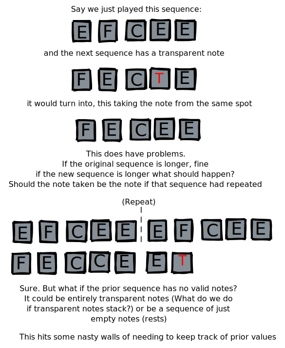
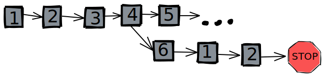
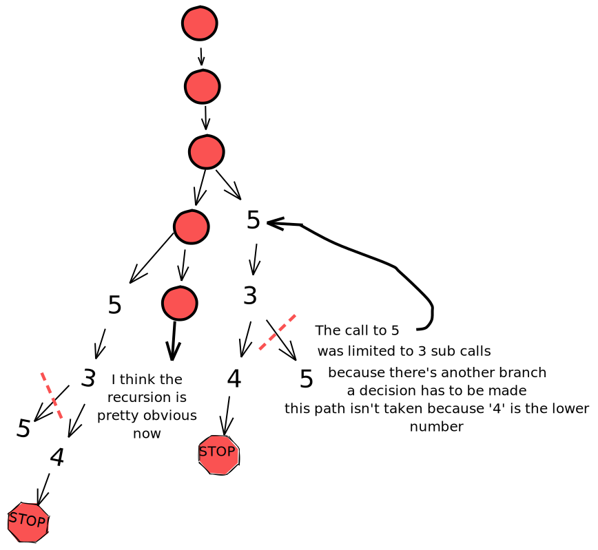
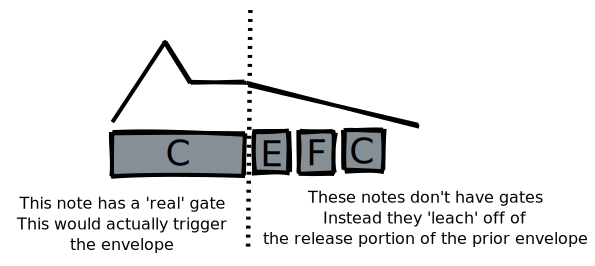
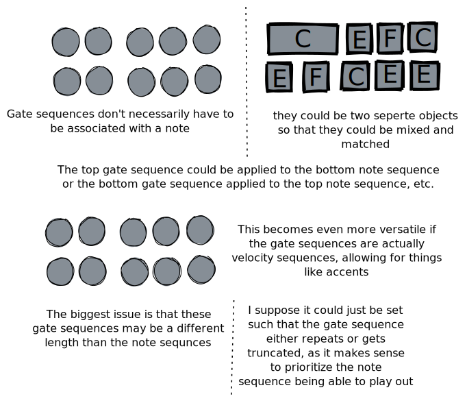

# AsciiSeq

> **?** This name sucks. Need something better.

This is an idea for a text based midi sequencer inspired by SonicPi and Orca

**NO CODE HAS BEEN WRITTEN YET** This is still in the early design phase.

## Core idea

Sequences of notes can be defined easily, for example

`1 = a,c,f,g,e,a` and `2 = e,e,e,a,f,g`

then these sequnces can be chained with simple rules

```
1 -> 2
2 -> 1
```

This would just play 1 and 2 in a loop forever.

## Chaining Sequences
Note, that any sequence entry point that is the `number ->`  must be unique, that is, each sequence destination can only be defined once.

sequence '1' is always the entry point.

Basic sequence chaining:
```c
1 -> 2
2 -> 3
```

Probabilistic Sequence Chaining. Probability is in increments of 10%. Not having a total of 100% will cause the remaining chance to be recursive.
```c
3 -> 5:4~5:5 		
// 50% chance to move to 4, 50% chance to move to 5
4 -> 1:5
// this would have 90% chance of repeating, 10% to go to seq 5
4 -> 1:5~9:4
// would be exactly equivilent. Note that having both these lines
// would be invalid as 4 can't be defined twice
```

variables aa-zz can store complex ops to used elsewhere. All lines must have a go-to (->) even if it results in an infinite loop

> **?** `0→_` can stand in for immediately redirecting to a new decision

note, that when using a variable in the definion of another varibale the go-to of the inner variable will be overridden.

```c
a = 5x4 -> 2
// repeat a sequence, here seq 4 is repeated 5 times, then goto 2
b = 3o4 -> 2
// the number of notes of a sequence to play (3 notes of seq 4)
c = 1u4 -> 2
// play the sequence shifted up one octave
d = 1d4 -> 2
// or down an octave
e = 2s4 -> 2
// s for slow, 1/2 speed
f = 3s4 -> 2
// or 1/3 speed, etc.
g = 2f4 -> 2
// f for fast, 2x speed
h = 1u2s3x3o4 -> a
// 1 octave up, repeat 3x, at half speed, the first 3 notes of sequence 4
i = 0 -> 3:5xb~7:5  // 30% chance to play the sequnce at b 5 times, 70% to go to seq 5
zz = ...
// variables can be up to two leters in length
5 -> A|6
// until statements, to wait on external input A-Z, think a BARS 6.
// should this just repeat the source until satisfied?
6 -> 5:g~3:h
// 50% chance of going to g's definiton, 30% → h, 20% chance to 
// repeat sequence 6 before deciding again
7 -> 2 -> 4
//the redirect to sequence 3 from sequnce to 2 is overridden, to go to 4 instead
8 -> 0r1
//play sequence 1 in reverse, note the 0 because 
// reverseing doesn't have any options
// this just keeps syntax consistant
```

| Operator | Name   | Description                                              |
| -------- | ------ | -------------------------------------------------------- |
| ->       | GoTo   | What sequence to play after the source sequence finishes |
| x        | Repeat | Number of Times to repeat the sequence                   |
| o        | Of     | Number of notes to play of the sequence.                 |
| u        | Up     | Number of Octaves Up to play sequence                    |
| d        | Down   | Number of Octaves Down to play sequence                  |
| s        | Slow   | slow down by division                                    |
| f        | Fast   | Speed up by multiple                                     |
| :        | Chance | ~ to chain                                               |
| \|       | Bar    | wait for input                                           |

## Making A Sequence

avail notes are c,c#,d,d#,e,f,f#,g,g# and n where n is no note. notes can also be defined as {40}, for example, to play a midi note number.

> **?** flat would be nice, but I think having syntax like eb is very confusing and I don't see a better symbol? maybe e♭ with unicode, but that's a bitch to type and fucks up the otherwise ascii format

> **?** syntax for chords in scale? This would need to be dramatically simplified. It might be best done using variables like in the patterns, but I think this would require some 'intelligence' like Cm-1 for C minor first inversion? Idk. My music theory isn't good enough for some of this.

> **?** syntax highlighting for notes that are out of scale?

CC's can be set wit {CCnum=val} or {CCLnum=val}

where the L(ock) variant will default back to the default value set for that CC in the config after the note off event

> **?** it would be nice to do time, like with PB, but that would depend on knowing the current CC value or at least the last value. Not sure if this is possible. Might need to be a per-CC option?

Other sequences can be referenced in a sequence with [seqnum]

> **?** This may require special attention to recursion, what would 4 = [4],a,c do? should it be invalid?

Pitch Bend can be set with {PB=±cents,time}. Assumes a PB range of ±2 semitones unless overridden and time is a 10% fraction of the gate time for the bend to complete. 0 for instant.

> **?** if more than one bend at a time is possible, this will require MPE. That could be rather complicated

Octave shifts can affect an entire line or a particular note

`1 = a,b@+1,c,d,e,f,g @-1`

@-1 at the end means to take the entire sequence down 1 octave. If the @-1 *didn't* have a space before it, it would only apply to the g before it, as is the case with the b@+1

> **?** should grouping an octave shift be possible? maybe `1 = {a,b}@+1,c,d,e,f,g @-1` to take the first two notes up an octave?

polyphony is possible using ';' to separate chords

`2 = a;c;e,a;d;f,a;c;f;{CC34=127}`
where the this would play a c and e together, followed by a d and f, then a c and f along with a CC change. Note the CC is done polyphony to avoid the CC taking a step of its own.

> **?** this syntax is a bit hard to read, should there be better grouping symbols? maybe `2 = {a;c;e},{a;d;f},{a;c;f;{CC34=127}}`


```c
3 = ^(a,d,f,a),d,f,a,e
// where ^() is an arpegio forced to fit in the time, so here would be a 4 note arp a,d,f,a
// ^_() will try force a constant gate (no retriggers)
4 = 5:a~5:c,e,5:a~5:!n,c
// 50% chance a, 50% chance c, then e, then a 50% chance of a or no note, then c
5 = [4],a,c
// play sequence 4, followed by a,c
6 = [4d1,4u1],a,c
// play sequence 4 shifted down an octave, followed by seq 4 up 1oct, followed by a,c
7 = [f],a,c
// play sequence at var f, ignoring the go-to, followed by a,c
8 = [1&2]
// play sequence 1&2 in parallel, using polyphony
9 = [0r3],a,c,f
// play seq 3 in reverse
10 = c,!e,f
// ! doesn't send a gate with the note... (how would this work with midi?)
11 = c;{PB=-50,5},e,g
// pitch bend down 50 cents, taking 50% of the note gate time to do so.
12 = $c,d,e$,g,a,c
// start holding the sustain pedal before C is played, release it before g is played
13 = !n,!n,!n,!n
// play no note for 4 notes. Note, that without the '!', this would still emit a gate if
// the last note can have it's gate sustained,
// on that note
14 = c,!n,n
// is equivilent to c,!n,c, as to send a gate (note on) signal requires some note, so the last 
// played note or group of notes is used.
15 = c,{PB=0,5}e,f
// will attempt to pitchbend from c to e in 50% of the gate of the e
15 = c,e{PB=+100,1},f
// will attempt to pitchbend from c to e+100cents in 10% of the gate of the e
// note, if using polyphony and multiple pitch bends are used I could either do MPE
// (probably very, very hard) or just take the first/last pitchbend
// orrrr just throw a syntax error
// note the difference here of the pitchbend not getting it's own note channel, that is
// before the pitch bend was being done polyphonically and in it's own spot
// where this one has a note before it.
16 = c...,e...,f...
// is the same as c,c,c,c,e,e,e,e,f,f,f,f UNLESS the gate lengths have been defined to be under a note
// long, this is a forced gate hold for the sake of operators that are dependent on gate time, 
// the length of the total gate is what the percentage is of, so 
17 = c,e...{PB=0,1},f
// will take 10% of the time of the 4 note gate, not of just one note. This allows for long glides
18 = ^(a,a,a,a),d,f,a,e
// ^() can be used for ratchets
19 = ^(a...)
// when the ^() sytax is used with an extended gate, a ratchet is implied, note that adding more '.'s
// further divides the time, making the ratchet faster
20 = ^(c.......)
// would be a twice as fast ratchet (8 notes in the time of 1)
21 = ^(d*12})
// is the same as ^(d,d,d,d,d,d,d,d,d,d,d,d) is the same as ^(d...........)
22 = c*3,e*97
// this syntax can be used anywhere, but it's a bit gross and easy to mistake for sharps
// still useful for when a note needs to be repeated many times
23 = c#,c#*3,e*97
// I mean it's not that bad, but it's a bit symbol-y
// note that *0 will play indefinitely.
24 = $c,{PB=0,5}e..$,^(f,a,c#);[1&2],[4d1],e,f,[1u2s3x3o4];{CCL34=127},g
// and with that we have a sytax that can get comically gross.
// note on polypony
25 = c;e...,a,d
// the first note will define the length of the note group, so here the c,e... cluster will
// only take 1 note space, and the e... will sustain over the a and d, as well as into the
// first note space of the next pattern
// technically, this could be used to make a drone
26 = !n;e*0
```

## Configuration Options

support for some global statements at top of each MIDI channel or top of file (global). Some are Global only.

this will require tracking some stats, such as how many times a sequence is played.

```c
MAX_PLAYS = 20
MAX_GOTO  = 1
// prevent any sequence from playing more than 20 times consequtively
MAX_NOTE = {70}
MIN_NOTE = {8}
// constrain note pitch
PBrange = 24
// set pitchbend range to 24 semitones. Assumes symmetric, so this is ±12 semitones.
CLK_IN = FALSE
// ignore the input midi clock from an external source
CLK_RATE = 120
// BPM if no external source
TRANSPOSE = -12
// Transpose everything down 1 octave
TRANSPOSE_U = +100
// Transpose Everything up 100 cents
RAND_SEED = whatever
// seed for random stuff. If not set, a new seed is chosen on each clock start/stop
CC24 = 0
CC25 = 64
// set the default values for CC's
SCALE = minor
// set the scale used to highlight out-of-scale notes
LAZY_CMAJOR = minor
// sets the notes of the major scale to just be indicators in a different scale
// this is super gross, but for example in C minor
// c stays c, d stays d, e becomes d#, f stays f, g stays g, a becomes a#, and b becomes b#
// this lets noobs like me treat everything like it's major for writing it. This will throw a 
// warning if you try to use a note off the major scale
// combine with transpose to get different keys
// options should be major (no change, but warn about non-major keys), minor, minor_mel,
// minor_harm, penta, and blues. not sure what to do with those with more than 7 notes.
// might let the notes availble expand, so for blues it could be
// a is a, b is a#, c is b, d is c, e is d, f is d#, g is e, then go into non-notes, so
// h is f, i is f#, and j is g
DRUMS = true
// use k,s,h,t,c as kick, snae, hat, tom, clap etc. assuming the standard midi drum mapping.
```
## Multiple Channels

Midi supports 16 channels. To take advantage of this, code can be surrounded with tags. This would only include the pattern chaining, as the sequences can go up to arbitrary numbers. This would allow for sharing sequences between midi channels, while still having different sequence chains. Per channel settings can be defined in these blocks as well.

```c

---1---
1 -> 2
2 -> 1
---1---
    
---2---
MAX_PLAYS = 3
MAX_GOTO  = 1
1 -> 2
2 -> 3
3 -> 5:1~5:3
---2---

---16---
TRANSPOSE = -12
1043 -> 234
...
---16---
```

## Ideas not thought though yet

All of the points bellow make me think it might not be a bad idea to separate the actually output format from the sequencer, if MIDI is all that's available, a translation layer from what the sequencer supports to what MIDI supports could be made. This helps future proof for MIDI 2.0, using CV/Gate, OSC, etc.

MIDI 2.0 looks like a PITA, but possibly the best option

... But seriously, why do all of these formats suck so hard.

* Conditionals on Midi Input?

* Conditional on repeat (only play this note every 3rd time this sequence is triggered)
  
  * Like Digitakt
  
* Muting - let one track be able to mute another
  
  * This could be done already by just assuming CC's can be used to mute the track on the target, but this still sounds like a good feature to have a dedicated syntax.
  
* Random notes- pick any note from scale

* 'Transparent' notes- play note at the position in the last sequence played

  

* Local Boolean variables and conditionals?
  * !$V to invert state, VT to set to true, VF to set to false?
  * Not sure how to implement these in- should there be a sequence op that checks a Boolean var to pick path? or should it be used in pattern chaining?
  * These might be able to be flipped externally via midi input, ref the BAR syntax.
  
* Need a syntax for comments. Probably just C Style // and /* */

* Parallel execution paths / branching, dead ends
  
  * It might be nice to allow for branched sequences, especially so a CC sequence could be 'imported' on top of multiple note sequences, for transparent notes, and for gate sequence overrides
  
  * My god does this get confusing quickly. What happens if two sequences try to play the same note? What if they have different velocities? What if a CC value is changed in two places at once? Should there be a maximum depth of splitting?
  
  * There's already a issue that allows for recursion: For example `4 = {4};{5},c` uses polyphony but calls its self. This would probably just need to have a hard limit like `MAX_REC_DEPTH=n` set in the config file.
  
  * But with parallel execution paths say `4 -> 5&6` have a lot more potential to have shit hit the fan. It may work if the sytax is expanded to something like `4->5&6.3`, where the first argument is the sequence that's allowed to keep going from the root, while a branch off to sequence 6 would only be allowed to go 3 steps (or whatever follows the `.`)
  
    ```c
    1 -> 2
    2 -> 3
    3 -> 4
    4 -> 5&6.3
    5 -> //whatever
    // Going to anything defined so far (1-6) would cause a loop
    // but this could just as easily go onto 7, then 8, etc
    6 -> 1
    // 6 goes back to 1, and 1->2 is defined above
    ```
  
    
  
     
  
    This would avoid the crazy recursion depth problem as everything would still have a max level, even in situations like
  
    ```c
    1 -> 2
    2 -> 3
    3 -> 4&5.3
    4 -> 3&5.3
    5 -> 3
    ```
  
    which is honestly hard to wrap your head around anyway. The key point is that the limit would have to be applied even to further branches so when 5 is called from 3 it has a limit of doing 3 sequences, even those from recursion. There may be problems where sequences need to be chosen. In the above code, the call tree would look like this, where the 'main branch' is in red circles:
  
    
  
    This same solution could be applied to any polyphonic calls of sequences, so `4 = {4};{5},c` would actually probably have to be `4 = {4};{5.n},c` where `n` is the max allowed recursion depth. While I only diagrammed and explained branching into 2 paths, things like `4 = {4};{5.3};{6.9},c,e,f` or whatever should be possible, letting recursion get much more gross. Even in the above tree more than 2 sequences definitely start playing at times. I think it only get's up to 5(?) in that example though.
  
* Should a VCV module that just runs a client be made? This would let significantly more interesting data types be sequenced, like envelopes and such, and work around some of the issues where MIDI assuming gate and note changing are tied together.

  * The MIDI Note/Gate problem may be solvable by either putting the gate notes on a different track (reserve tracks 9-16 for gate events, mirroring the notes) or by using an 'unusable' note to send gate messages, either note 0 (which is literally below 20hz) or note 127 (Which is 12.5khz, sorta awful). This would only realllly work monophonically though, so it's still not super clean. The easiest solution is to say fuck midi all together, maybe only target eurorack, VCV, or mayyyybeee MIDI 2.0/OSC

    * just use a very low velocity, maybe 0? I don't know that vel=0 is the same as a note off, as long as it's not it *should* work? 

      * MIDI 2.0 Spec 4.2.2 says:

        > The allowable Velocity range for a MIDI 2.0 Note On message is 0x0000-0xFFFF. Unlike the MIDI
        > 1.0 Note On message, a velocity value of zero does not function as a Note Off. When translating a
        > MIDI 2.0 Note On message to the MIDI 1.0 Protocol, if the translated MIDI 1.0 value of the
        > Velocity is zero, then the Translator shall replace the zero with a value of 1.

        which seems to imply this could work.

        Similarly, in 4.2.14 it's implied that pitch could be varied on the same note, sorta MPE like. This might make more sense, though the goal is to let the original notes release envelope be what's enveloping the subsequenet notes, so I'm not sure. I *think* the velocity of 0 is the right answer here, but without a MIDI 2.0 test bed it's hard to tell.

        

  * Another shit solution would be to send midi 'gate' as a bunch of CCs, maybe taking CC0-5 for 6 voice polyphony. Still gross as hell.

* Some special modes, like euclidean stuff, would be cool

* Per sequence time divisions are probably a necessity. I'm not sure on the syntax?

  * Maybe expand the @-1 octave syntax into @{-1,4/4} for down one octave in 4/4 for example?
  * I'll have to brush up on how that musical notation actually works, but if it's literally multiply/divide this works well, something like 8/4 would double the speed? The fact that the number of notes can vary could be weird though, as we might not actually end on a bar marker?

* Easy pattern locking to make a pattern repeat for the sake of editing it, maybe just putting a `!` before it? Or should there be something special in the IDE?

* I'd like to have the option to disassociate midi notes from gates entirely, to define a gate sequence 'override', so that different gate sequences can be applied to different note sequences.

  

  this would definitely incur a lot of edge cases though, like a 'late' gate on a longer note, gate sequences with a different time signature or rate, etc. This would probably be a pain to program for, but if done correctly could be incredibly expressive

  Notes with accents would be really nice though. This could assume a velocity of like 75% normally (in config) and have an accent velocity of 100% (or whatever in config?). Because textually inputting velocity a lot would super suck I think only having 2 or 3 levels would be ideal: Weak, normal, and strong makes sense. Need to figure out Syntax.

* Might be helpful to include some verrrrry basic S&H, LFO, etc. functionality. Maybe some global random sources, so if a rand is inserted and triggered in two places it can either be the same or unique

  This would almost certainly be inspired from the Digitakt's LFO modes, which are great.

* ~~CCs might need to have LSB,HSB for extra resolution, not sure how this would work out?~~

  midi 2.0 would make this irreverent, and I just can't justify targeting a spec as under powered as 1.0 or something as unused as OSC.

